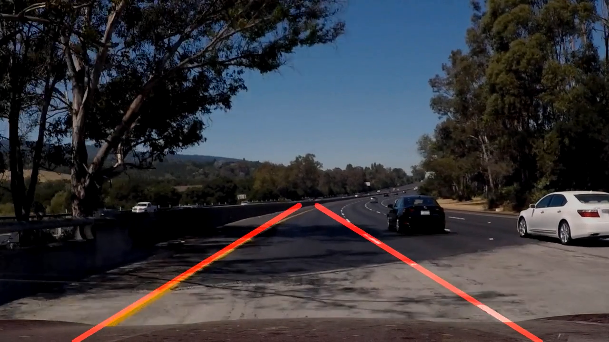

# **Finding Lane Lines on the Road** 

Overview
---
Note: This project is a part of my "Self-Driving Car Engineer Nanodegree" course at Udacity.  

When we drive, we use our eyes to decide where to go.  The lines on the road that show us where the lanes are act as our constant reference for where to steer the vehicle.  Naturally, one of the first things we would like to do in developing a self-driving car is to automatically detect lane lines using an algorithm.

In this project you can detect lane lines in images using Python and OpenCV.  OpenCV means "Open-Source Computer Vision", which is a package that has many useful tools for analyzing images.  

In this project, there are two important files: a file containing project code (lane_line_detector.ipynb) and a file containing a brief write up explaining my solution (writeup.md).

The Project
---

**Step 1:** Set up the [CarND Term1 Starter Kit](https://github.com/udacity/CarND-Term1-Starter-Kit/blob/master/README.md) if you haven't already. You should install the starter kit to get started on this project. After popping up the website, I suggest to use the "Anaconda Environment" if you are new.

**Step 2:** Open the code in a Jupyter Notebook

You can see my project code in a Jupyter notebook (lane_line_detector.ipynb).  If you are unfamiliar with Jupyter Notebooks, check out [Udacity's free course on Anaconda and Jupyter Notebooks](https://classroom.udacity.com/courses/ud1111) to get started.

Jupyter is an Ipython notebook where you can run blocks of code and see results interactively.  All the code for this project is contained in a Jupyter notebook. To start Jupyter in your browser, use terminal to navigate to your project directory and then run the following command at the terminal prompt (be sure you've activated your Python 3 carnd-term1 environment as described in the [CarND Term1 Starter Kit](https://github.com/udacity/CarND-Term1-Starter-Kit/blob/master/README.md) installation instructions!):

`> jupyter notebook`

A browser window will appear showing the contents of the current directory.  Click on the file called "lane_line_detector.ipynb".  Another browser window will appear displaying the notebook.  Follow the instructions in the notebook to understand and run the project compeletely by your self.  

Referencing The Project
---
If you like my code and you want to use it in your project, please refer it like this:

`Amani, Sajjad. "Finding Lane Lines on the Road." GitHub, 28 June 2019, https://github.com/Sj-Amani/LaneLines_Detector .`

